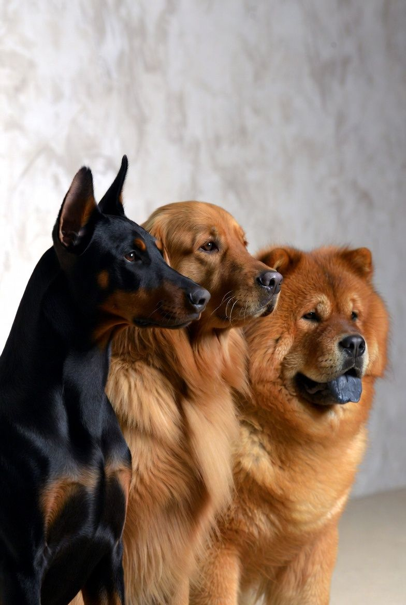

# Stanford Dogs Breed Classification
### Multi-Backbone CNN Feature Fusion with PCA and Support Vector Machine

---

## Abstract

Dog breed identification from images is a difficult computer vision problem because many breeds look nearly identical to the human eye. This project builds a classification system that can correctly identify the breed of a dog from a photo across 120 different breeds, achieving **94.80% accuracy** on held-out test images. The system works by combining the "visual knowledge" of four state-of-the-art deep learning models pretrained on ImageNet, merging their outputs into a single rich description of each image, and training a classical machine learning classifier on top. No expensive end-to-end neural network training was required.

---

## 1. Introduction

Identifying dog breeds from photographs is harder than it sounds. The 120 breeds in the Stanford Dogs dataset share similar body structures — the difference between a Siberian Husky and an Alaskan Malamute, or a Collie and a Border Collie, can come down to subtle facial markings or coat texture. At the same time, the same breed can look very different depending on age, pose, lighting, and background. Standard image classifiers that treat all differences equally struggle with this kind of fine-grained recognition.

The core challenge is: how do you build a system that reliably picks up on those subtle visual differences, using only ~150 training images per breed, without overfitting?

The answer pursued here is **transfer learning with feature fusion**: instead of training a single neural network from scratch, four large models already trained on 1.2 million ImageNet images are used to describe each dog photo. Each model has learned a different "visual vocabulary" from its architecture, and combining their descriptions gives a much richer and more robust representation than any single model alone.

---

## 2. Materials and Methods

### 2.1 Dataset

The Stanford Dogs dataset contains 20,580 labeled dog images across 120 breeds, organized into one folder per breed. The data was split deterministically (seed = 42) into:

- **Training set:** 15,435 images (75%)
- **Validation set:** 3,087 images (15%)
- **Test set:** 2,058 images (10%)

The test set was kept completely separate and only used once, at the very end, to report final performance. All images were resized to 331 × 331 pixels.

### 2.2 Feature Extraction with Four CNN Backbones

Four convolutional neural networks, each pretrained on ImageNet, were used as frozen feature extractors — meaning their weights were never modified. Each network was loaded without its final classification layer (`include_top=False`) and with global average pooling, so that each image is compressed into a single fixed-length feature vector:

| Model | Feature vector size | Architecture style |
|---|---|---|
| InceptionV3 | 2,048 | Factored convolutions |
| InceptionResNetV2 | 1,536 | Inception + residual connections |
| NASNetLarge | 4,032 | Neural Architecture Search |
| EfficientNetB3 | 1,536 | Compound scaled CNN |

Each model was loaded, all images were passed through it to extract features, and the results were saved to disk. The model was then deleted from memory before loading the next one, keeping GPU memory usage manageable.

**A critical implementation detail:** the dataset used for feature extraction must be unshuffled, and its order must exactly match the order of the stored labels. A shuffled extraction dataset causes a complete mismatch between features and labels, which produces near-random predictions regardless of model quality.

### 2.3 Feature Concatenation

The four feature vectors for each image were joined end-to-end into a single vector of 9,152 dimensions (2,048 + 1,536 + 4,032 + 1,536). This combined representation captures complementary visual information: InceptionV3 sees the image through a factored convolutional lens, NASNetLarge through an architecture optimized by neural search, and so on. Together they describe the image far more completely than any one model.

### 2.4 Standardization

Because the four backbones produce activations at different numerical scales, a StandardScaler was applied — transforming every feature dimension to zero mean and unit variance across the training set. This step is essential: without it, PCA is dominated by whichever backbone happens to produce the largest numbers, and the contributions of the other three backbones are lost. The scaler was fitted only on training data and then applied to validation and test sets.

### 2.5 Dimensionality Reduction with PCA

Principal Component Analysis (PCA) was applied to reduce the 9,152-dimensional scaled vectors to **256 principal components** with whitening. This serves two purposes: it removes redundant dimensions across the four backbones, and it produces a compact, decorrelated feature space that is well-suited for a linear classifier. Again, PCA was fitted on training data only.

### 2.6 Classification with LinearSVC

A Linear Support Vector Machine (LinearSVC) with regularization parameter C = 0.1 was trained on the 256-dimensional PCA features. The `dual=False` solver was used because the number of training samples (15,435) is much larger than the number of features (256), which makes the primal formulation significantly faster to solve. The model converged successfully within 10,000 iterations.

---

## 3. Results

The classifier was evaluated on the held-out test set of 2,058 images across 120 breeds:

| Split | Accuracy |
|---|---|
| Training | 98.52% |
| Validation | 94.23% |
| **Test** | **94.80%** |

### Per-Class Highlights

Ten breeds were classified with **perfect precision and recall** on the test set:

| Breed |
|---|
| Pekinese |
| Toy terrier |
| Papillon |
| Blenheim spaniel |
| Bluetick |
| Norwegian elkhound |
| Basset |
| Saluki |
| Airedale |
| Scotch terrier |

The ten most challenging breeds were:

| Breed | F1-score | Test images |
|---|---|---|
| Eskimo dog | 0.583 | 11 |
| Siberian husky | 0.682 | 24 |
| Lhasa | 0.759 | 16 |
| Collie | 0.769 | 15 |
| Yorkshire terrier | 0.800 | 7 |
| Shih-Tzu | 0.800 | 16 |
| Malamute | 0.813 | 16 |
| Walker hound | 0.815 | 13 |
| American Staffordshire terrier | 0.833 | 17 |
| Border collie | 0.846 | 11 |

---

## 4. Discussion

The system correctly identifies the breed in 9 out of every 10 test images, with no end-to-end neural network training and no manual feature engineering.

The classes where the system struggles are instructive. Eskimo dog, Siberian Husky, and Malamute are visually nearly identical arctic spitz dogs — even experienced dog owners regularly confuse them. Collie and Border Collie differ mainly in subtle facial proportions. Lhasa Apso and Shih-Tzu share essentially the same body type and coat. These errors are not failures of the pipeline; they reflect a genuine visual ambiguity that challenges even humans. The global average pooling used here compresses the entire image into a single vector, discarding spatial information about where differences appear (e.g., ear shape, facial markings). A model that explicitly attends to discriminative regions would be better suited to these hard pairs.

The gap between training accuracy (98.52%) and test accuracy (94.80%) is modest and expected — it reflects the genuine difficulty of fine-grained breed discrimination rather than severe overfitting, especially given that the worst classes are the visually hardest ones.

---

## Acknowledgments

This project was developed and run on Kaggle Notebooks, using a Tesla P100-PCIE-16GB GPU provided free of charge by Kaggle.

---

## Literature Cited

- Khosla, A., Jayadevaprakash, N., Yao, B., & Fei-Fei, L. (2011). Novel dataset for fine-grained image categorization: Stanford Dogs. *CVPR Workshop on Fine-Grained Visual Categorization.*
- Szegedy, C., Vanhoucke, V., Ioffe, S., Shlens, J., & Wojna, Z. (2016). Rethinking the Inception architecture for computer vision. *CVPR 2016.*
- Szegedy, C., Ioffe, S., Vanhoucke, V., & Alemi, A. (2017). Inception-v4, Inception-ResNet and the impact of residual connections on learning. *AAAI 2017.*
- Zoph, B., Vasudevan, V., Shlens, J., & Le, Q. V. (2018). Learning transferable architectures for scalable image recognition. *CVPR 2018.*
- Tan, M., & Le, Q. V. (2019). EfficientNet: Rethinking model scaling for convolutional neural networks. *ICML 2019.*
- Deng, J., Dong, W., Socher, R., Li, L.-J., Li, K., & Fei-Fei, L. (2009). ImageNet: A large-scale hierarchical image database. *CVPR 2009.*
- Pearson, K. (1901). On lines and planes of closest fit to systems of points in space. *Philosophical Magazine*, 2(11), 559–572.
- Cortes, C., & Vapnik, V. (1995). Support-vector networks. *Machine Learning*, 20(3), 273–297.

---

## Appendix — Pipeline Architecture

```
Stanford Dogs Dataset (20,580 images, 120 breeds)
            │
            ▼
    75 / 15 / 10 train / val / test split
            │
            │   [Unshuffled extraction pipeline]
            │
    ┌───────┼──────────┬──────────────┬──────────────┐
    ▼       ▼          ▼              ▼              ▼
InceptionV3  InceptionResNetV2  NASNetLarge   EfficientNetB3
 (2,048)        (1,536)          (4,032)         (1,536)
    └───────┬──────────┴──────────────┴──────────────┘
            ▼
    Concatenate → 9,152 dimensions per image
            ▼
    StandardScaler (fit on train only)
            ▼
    PCA: 9,152 → 256 components, whiten=True
            ▼
    LinearSVC  C=0.1, dual=False
            ▼
    Test accuracy: 94.80%  (120 classes)
```
